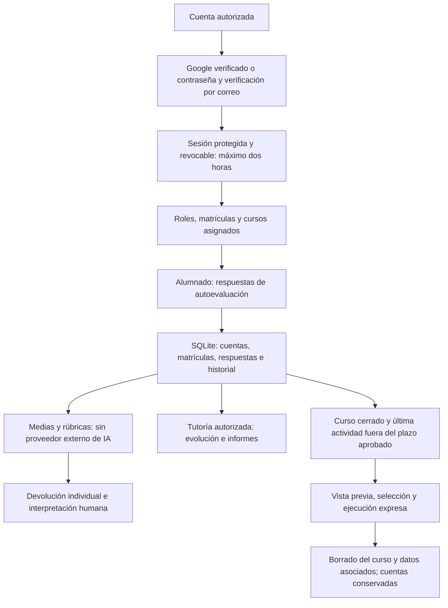

# Autopercepción de Competencias Clave

Aplicación para que el alumnado valore sus competencias clave, reciba una devolución y permita al profesorado tutor analizar la evolución de sus cursos.

El proyecto se divide en `backend` (Flask y SQLite) y `frontend` (Angular 21, Signals, Bootstrap y Sass). Consulta primero [Privacidad y actualización](docs/PRIVACIDAD_Y_ACTUALIZACION.md), que incluye el diagrama, las variables necesarias y la migración para PythonAnywhere. Esta guía actualiza las instrucciones de despliegue anteriores.

## Adecuación al RGPD

Documentación revisada el 9 de octubre de 2026 a partir de los diagramas del informe inicial y del código actual. Describe las medidas implementadas; la configuración y autorización de producción deben comprobarse aparte.

La aplicación incorpora altas autorizadas y verificadas, sesiones revocables en cookies protegidas y permisos por curso y tutoría. Calcula medias y resultados de rúbricas para interpretación humana; este proyecto no integra un servicio externo de IA. El borrado de cursos cerrados exige un plazo aprobado desde su última actividad, vista previa, selección y ejecución expresa. Las cuentas se conservan y deben revisarse separadamente, junto con exportaciones y copias.

Estos controles apoyan la adecuación al RGPD, pero no acreditan por sí solos el cumplimiento ni sustituyen la autorización del centro. Antes del uso con datos reales deben verificarse en el despliegue, completar la información de privacidad, revisar proveedores y condiciones de tratamiento y aprobar la conservación y el borrado, incluidas copias y exportaciones.

La página `/privacidad` muestra `PRIVACY_CONTROLLER`, `PRIVACY_CONTACT`, `PRIVACY_LEGAL_BASIS`, `PRIVACY_RETENTION` y `PRIVACY_PROVIDERS`, configuradas en el `.env` de cada despliegue (`backend/.env` en Generador de equipos). `PRIVACY_RETENTION` es texto informativo y no activa el borrado. Consulta los plazos y comandos operativos en la guía específica.

[Guía de privacidad](docs/PRIVACIDAD_Y_ACTUALIZACION.md) · [Web](https://competenciasclaveauto.eu.pythonanywhere.com/).

El enlace utiliza el nuevo dominio europeo. La migración está en curso según la información disponible; debe confirmarse su finalización, la versión desplegada y el tratamiento de las copias del alojamiento anterior. Alojar en Europa no determina dónde procesan los datos otros proveedores.

## Flujo de funcionamiento y datos

Los pasos de conservación representan una operación de mantenimiento que debe configurarse y ejecutarse; no un borrado automático por el mero transcurso del plazo.

## Inicio rápido

1. Copia `.env.example` como `.env`, genera claves aleatorias y configura correos autorizados, SMTP y privacidad. Solo para desarrollo HTTP, usa `COOKIE_SECURE=false`.
2. Activa un entorno virtual e instala `backend/requirements.txt`. Desde `backend`, para una base nueva ejecuta `flask --app run db upgrade` y después `flask --app run init-db`. La carga inicial requiere la plantilla de cuestionario indicada en la guía, ausente del repositorio. Para bases existentes, sigue la migración documentada.
3. En `frontend`, instala las dependencias con `pnpm install --frozen-lockfile` y arranca `pnpm start`.
4. Ejecuta las pruebas desde `backend` con `python -m unittest discover -s tests -v`. Usan datos sintéticos y no requieren la plantilla.
