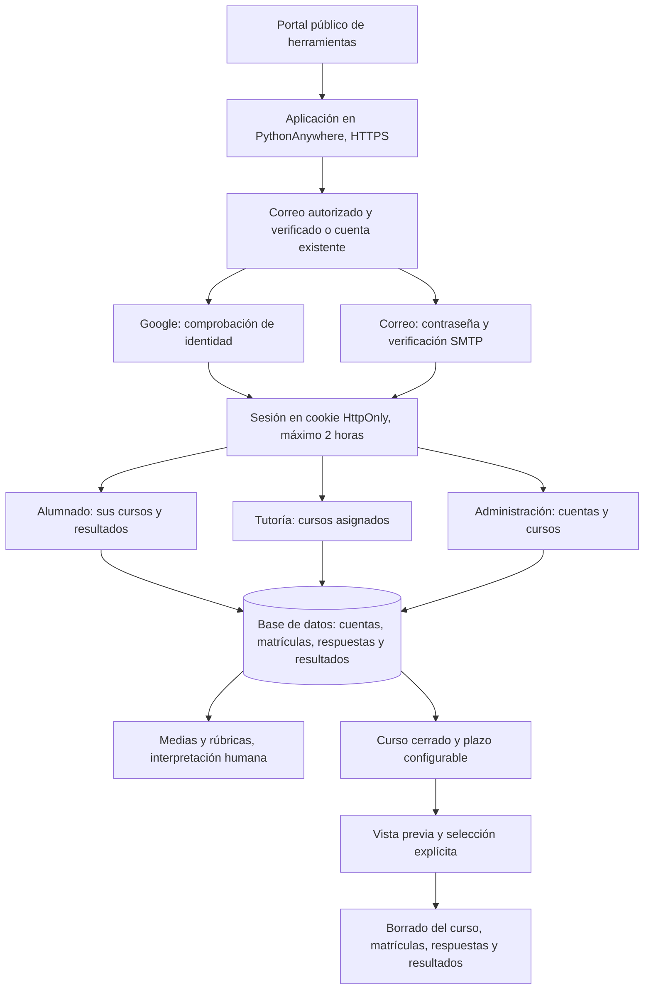

# Privacidad y actualización de competenciasclave.auto

Cambios locales preparados el 6 de octubre de 2026. Esta guía describe la versión modificada; no acredita el despliegue ni sustituye la validación del centro.

## Funcionamiento



El portal enlaza a la aplicación. Google interviene si se elige ese acceso y el proveedor SMTP recibe el correo de verificación. Las exportaciones descargadas por tutoría salen del control del servidor. En este código no se han encontrado llamadas a proveedores de IA; si la instalación tiene otro código o integración, debe revisarse aparte.

## Cambios de seguridad y acceso

- La sesión deja de viajar por la URL o guardarse en localStorage. El navegador utiliza una cookie HttpOnly, Secure en producción y SameSite=Lax. Las operaciones autenticadas de escritura requieren un token CSRF; todas las escrituras requieren también una cabecera de la aplicación y rechazan orígenes externos.
- El cierre de sesión invalida todas las sesiones de la cuenta. Los cambios administrativos invalidan las sesiones previas. La opción «Activo» permite bloquear una cuenta conservando sus datos hasta resolver su conservación o supresión.
- Login y registro admiten como máximo 10 solicitudes por correo y 200 por dirección de origen en ventanas fijas de 15 minutos, por endpoint. Los contadores se comparten entre procesos mediante la base de datos; guardan identificadores HMAC, sin el correo ni la IP en claro. Se limpian al recibir la siguiente solicitud de autenticación o mediante `flask --app run purge-auth-attempts`; programar esa limpieza para periodos sin uso. Comprobar en el alojamiento que la dirección de origen usada es la correcta antes de ajustar límites; no se confía ciegamente en cabeceras de proxy enviadas por el cliente.
- El alta pública solo admite correos exactos incluidos en `REGISTRATION_EMAILS`. Una cuenta creada previamente por administración puede entrar mediante Google. `ADMIN_EMAILS` permite designar administradores tras verificar su correo; para retirar esa designación, quitarla también de la configuración y cambiar el rol en administración. No hay correos personales privilegiados por defecto.
- Las cuentas que ya existían se conservan activas en la migración: el centro debe revisar su legitimidad, permisos y necesidad antes de reabrir el servicio. Quitar un correo de la lista de altas no desactiva una cuenta existente: usar «Activo».
- Sin SMTP funcional, el alta devuelve un error y no crea la cuenta. No se registran el destinatario ni el enlace, ni se ofrece un enlace de verificación en modo depuración. Los enlaces caducan a las 24 horas y no pueden reutilizarse una vez verificada la cuenta. No se ha añadido recuperación de contraseñas.
- Las invitaciones públicas muestran únicamente identificador, nombre y año del curso. Los cursos cerrados no admiten nuevas respuestas. Se mantienen las restricciones de tutoría y la consulta individual del alumnado.
- `/privacidad` informa de finalidad, datos, accesos, cálculo y derechos. Los campos institucionales vacíos se muestran como pendientes. Los resultados incluyen un aviso de interpretación humana.

## Configuración previa

Usar `.env.example` como referencia; no sobrescribir el archivo existente. Se carga primero `backend/.env`, después `.env` de la raíz, sin sobrescribir variables del entorno. Evitar archivos duplicados con valores contradictorios.

| Variable | Valor que debe decidir el centro |
|---|---|
| `SECRET_KEY`, `JWT_SECRET_KEY` | Claves aleatorias de al menos 32 caracteres; generar dos diferentes y guardarlas fuera de Git. Las claves vacías o los ejemplos conocidos impiden arrancar. |
| `DATABASE_URL` | Ruta de la **base existente**, preferiblemente absoluta. No cambiarla por una base vacía al actualizar. |
| `FRONTEND_URL`, `BACKEND_URL` | La misma dirección HTTPS de la aplicación en PythonAnywhere, sin barra final. |
| `COOKIE_SECURE` | `true` en producción. `false` solo en desarrollo local HTTP. |
| `SPA_DIST_PATH` | Ruta absoluta a `frontend/dist/autopercepcion-cc/browser`. |
| `ADMIN_EMAILS` | Correos exactos autorizados para administración. |
| `REGISTRATION_EMAILS` | Correos exactos autorizados para nuevas altas, separados por comas. Vacío impide nuevas altas públicas. |
| `GOOGLE_CLIENT_ID`, `GOOGLE_CLIENT_SECRET` | Credenciales institucionalmente autorizadas; callback HTTPS `/api/auth/google/callback`. |
| `SMTP_*` | Servicio y remitente aprobados por el centro. |
| `RETENTION_DAYS` | Entero positivo aprobado por el centro. Vacío deshabilita la operación de conservación. |
| `PRIVACY_CONTROLLER` | Identidad y datos de contacto del responsable. |
| `PRIVACY_CONTACT` | Canal para derechos y contacto del DPD, cuando corresponda. |
| `PRIVACY_LEGAL_BASIS` | Base y justificación aplicables al uso educativo concreto. |
| `PRIVACY_RETENTION` | Plazos o criterios, incluyendo cuentas, cursos, exportaciones, registros y copias. |
| `PRIVACY_PROVIDERS` | PythonAnywhere, Google cuando se use y SMTP; ubicación, encargados y transferencias conforme a los acuerdos reales. |

Las cookies y la protección CSRF están preparadas para servir frontend y API bajo el mismo origen. En desarrollo se usa el proxy de Angular para `/api` y `/privacidad`. No publicar el frontend en GitHub Pages con la API en otro dominio sin rediseñar y verificar el acceso.

## Actualización en PythonAnywhere

1. Programar una ventana sin escrituras y respaldar base de datos, configuración y código anterior en un lugar restringido. Probar primero con una copia de la base; no usar datos reales en los tests.
2. Copiar código y frontend actualizado. Instalar `backend/requirements.txt` en el entorno virtual de la aplicación. Para compilar localmente: desde `frontend`, `pnpm install --frozen-lockfile` y `pnpm build`; usar la política de scripts de dependencias aprobada por el proyecto.
3. Completar las variables anteriores. Forzar HTTPS en el alojamiento y comprobar que la URL de callback de Google coincide con la configurada. La app no debe ejecutarse con debug.
4. Desde `backend`, con el entorno virtual activado, consultar `flask --app run db current`. Si la base ya está en `7182b36853ab`, ejecutar `flask --app run db upgrade`. La migración añade `active` y `auth_version` a `users`, crea la tabla de contadores de autenticación y conserva las filas existentes.
5. Si la base se creó mediante `init-db` y no tiene historial Alembic, comparar primero su esquema con la migración inicial. **Solo tras comprobar que coincide**, registrar `flask --app run db stamp 7182b36853ab` y después `flask --app run db upgrade`. No marcar una base desconocida como migrada. `init-db` no actualiza columnas existentes.
6. Para una instalación nueva, ejecutar `db upgrade` antes de `init-db`. La carga inicial del cuestionario requiere el archivo `backend/Template Formulario CCs (respuestas).xlsx`, ausente del repositorio clonado. Usar una plantilla sin respuestas ni datos personales; una actualización con competencias ya cargadas no necesita volver a importar.
7. Recargar la aplicación. Las sesiones anteriores dejan de ser válidas. Verificar con cuentas de prueba acceso local, Google, cierre, cuenta desactivada, tutor sin curso asignado, envío, exportaciones y privacidad. Las pruebas automáticas simulan Google y SMTP; no sustituyen esta comprobación del servicio real.
8. Si hay que volver atrás, restaurar conjuntamente código, configuración y copia de la base dentro de la ventana de mantenimiento. Evitar perder escrituras posteriores a la copia.

## Conservación y supresión

El plazo empieza en la fecha más reciente entre creación/actualización del curso, matrículas y cuestionarios. Al cerrar un curso se actualiza su fecha; solo son candidatos los cursos inactivos cuya última actividad supera el plazo. Los cursos activos nunca son candidatos.

Desde `backend`:

```sh
flask --app run purge-expired
flask --app run purge-expired --course-id 12
# Solo tras revisar el curso seleccionado y la necesidad de conservarlo:
flask --app run purge-expired --course-id 12 --execute
```

El identificador 12 es un ejemplo: usar únicamente los identificadores revisados. Se puede repetir `--course-id`. Si cualquier selección no es elegible, se rechaza la operación entera. No hay tarea programada ni plazo inventado. Mantener el servicio sin escrituras durante el borrado para evitar cambios concurrentes.

El borrado elimina el curso, sus matrículas, respuestas, resultados y asociaciones de tutoría. Conserva las cuentas y las rúbricas compartidas; las cuentas se revisan por separado y pueden eliminarse desde administración cuando proceda. Antes de ejecutar, comprobar reclamaciones o deberes que exijan conservación. El borrado lógico de filas no garantiza sobrescritura física de SQLite y no elimina descargas, registros ni copias de seguridad: aplicar también la política institucional a esas ubicaciones.

## Requisitos pendientes para aceptación institucional

El centro debe aprobar la finalidad, base, uso con menores, necesidad de las cuentas, responsables de gestión, plazos y atención de derechos. Debe revisar la contratación y titularidad de PythonAnywhere y los demás proveedores, ubicación y transferencias, permisos de administradores y tutores, gestión de incidentes y evaluación de riesgos. El correo Gmail de la cuenta de alojamiento no demuestra por sí mismo quién es el titular contractual.

Revisar especialmente los registros de acceso del alojamiento: pueden contener rutas de verificación o invitación aunque el código ya no las escriba en sus mensajes de diagnóstico. Limitar acceso y conservación y configurar su ocultación cuando el proveedor lo permita. Los códigos de invitación deben circular solo entre personas autorizadas.

La evaluación técnica local cubre los cambios de esta versión. No equivale a una auditoría completa de dependencias, del alojamiento ni a una certificación de cumplimiento RGPD.

## Comprobación local

Desde `backend`: `python -m unittest discover -s tests -v`. Los datos de prueba son sintéticos y la prueba de migración utiliza una base temporal aislada. Desde `frontend`: `pnpm build`.
